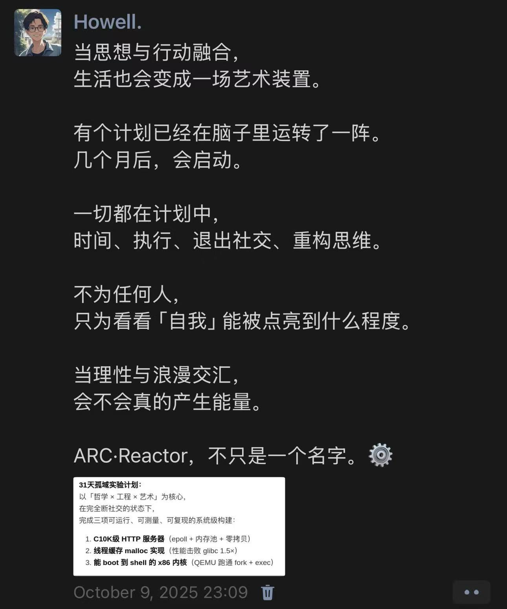

# The Solitude Protocol 

今天是闭关的最后一天，我已经完成了所有的任务，不过某些指标还是有些欠缺，后期我会继续优化。按照惯例，这篇文章则是用于总结我在过去30天的经历与收获。

---

## I. 一个想法和一条推
几个月前的某一天，我正在上课，脑子中突然冒出了一个念头 —— “我们这一代是不是退化了？前辈们能全靠自己的脑子写出完整的项目代码，而大多数的‘我们’只能靠在网上搜索或者直接问 AI，然后 Ctrl+C、Ctrl+V 一下，所有事情就都解决了”。
随后我就去和 AI 交流了一下，AI 让我意识到，我可能真正怀念的是那个必须对代码有深刻理解的时代，那个大家都愿意真正静下心来去思考问题、去做一个项目的时代。于是我就在想，我是不是该让自己适当的“疼一下”？让自己能对真正的底层有所理解，让自己能对这个新时代世界的基础有所理解，或者退而求其次 —— 仅仅只是体验？体验一回那个计算机刚刚发源的时代，前辈们日夜钻研的时代？亦或是 just for fun？
那时我还在构思，到底做点什么？我正盲目得刷着 X，这时一条推文映入我的眼帘 —— “*If you want to understand computers, write your own operating system....*”，具体内容我记得不是很清楚了，但大概就是这句话（或者就是这个意思）。然后，那节课我就没再听了，我专注于和 AI 讨论，到底做什么？怎么做？什么时候做？在那一天要结束的时候，我终于制定好了计划，并且下定了决心，寒假闭关一个月，专注于理解和构建一个属于自己的 Server、Malloc 以及简单的 OS。
同时，为了防止自己几个月后忘记或者怠惰，我在那一天的最后几分钟，在 WeChat 上发出了这条朋友圈：

---

## II. 闭关开始前

我也曾在和人轻度交流过这件事，但是大部分人的态度是 —— 不是很有必要 —— 工具做出来就是给我们用的，我们会用就可以了，没必要再从底开始。一开始支撑着我的是倔强 —— 我说出来的事情不管到最后对我有没有用，我都要做到。说实话，其实这次闭关计划是我的一次心血来潮（？可能吧，也有可能是蓄谋已久）。总之，我其实也没有认识到这件事情的意义，所以我一直都是有点迷茫的状态，加之我本身就有实习工作和论文需要撰写，就更加有点动摇了。
这里补充一下，为什么是轻度交流呢。主要是因为我有预设 —— 我周围的大家都更倾向于，**回报速度快、回报率高的事情**，对于回归底层的“反向进化”，确实是会有不少的反对和抵触。所以关于这个计划，我说得很少。
OK。回归正题。有一天晚上，我刚在 Youtube 上看完 `LinusTechTips` 这个博主和 Linus Torvalds 的一期合作视频，和 Linus Torvalds 久违的“见面”，让我又回到了那个短语 —— “**Just For Fun**”， 一开始给我带来的震撼。Linus Torvalds 在视频里这么说他在家做的一个吉他效果器：“Uh, it's a guitar effects pedal. It's a bad one, don't get me wrong. It's a horribly bad one. You'd never use this in real life. **But I enjoy designing these things** and I actually soldered these small pieces myself. I built this at home.” 什么是 JUST FOR FUN, 这就是 JUST FOR FUN。有时候不太需要在乎一件事是否有意义，你感兴趣，并且愿意为了它去花时间，这本身就是一件很有意义的事情。加之我就是对计算机感兴趣才会选择这个专业，所以为什么不为了自己的爱好“心血来潮”一把呢？
于是我坚定地继续为自己的闭关计划进行规划和搜集资料。

---

## III. 闭关期间

说实话，第一天是非常痛苦的，看着全英文的资料，写着自己完全不熟悉的代码（这是我第一次真正意义上写工程代码），第一天结束的时候整个人都是虚脱的，头疼到爆炸。不过后面几天倒也是慢慢适应回来了，头也不再疼了，一切至少都开始正常起来了。不过适应期过了之后就是回调期了，我也曾懈怠、拖延、不想写，但是看着 Github 的热力图密集起来，commit记录一条一条循序渐进，最终还是逼着自己完成了。虽然后期有些难度实在是高的任务，我还是求助了 AI，但是我依旧坚持理解后再往上敲，所以也不算是太违反闭关规则。
虽然断掉了社交媒体，但是邮箱还开放着用于接收紧急信息，这就导致有时我不得不处理导师发来的邮件，以及处理论文的相关事宜，有些天的进度稍显落后，不过好在后面慢慢补了回来，这点上没有完全按照闭关的规则来，但是也算是可以接受的。
具体的感受也记不得太多了，如果要形象化描述自己三十天的状态的话，那就是波动性平稳，后面有些许下降，不过整体任务还是完成了的，有些优化做得不太到位的地方后面会优化然后整理为一个单独的 Github 项目。
到了最后一天我自己也不知道关于这些项目我还记得多少具体的知识点，不过我对工程、代码以及架构有了一些我之前从未感受到的体会（我第一次做真正的工程项目，可能得出的感悟在各位大佬眼里只是小儿科，如要批评指正，还请手下留情）：

### 1."In summary, we should always try to use the fewest number of system calls necessary to get the job done."
这是我在《UNP》一书中摘下来的句子，虽然我在实际编程中并没有遇到因为使用太多系统调用而产生问题的情况，不过这句话会在我未来做一切事情的时候起到警示作用，以防出现因为系统调用过多而产生问题。

### 2."Stay humble in the face of everything."
我闭关只用了一个月，虽然对服务器、TCMalloc以及OS有了很宏观的认识和一点点微小的理解，但是很多东西都只是粗浅地了解了一下，我发现要真正做成可以用于生产的的产品还需要很多知识和优化，不过我觉得这次闭关的目的已经达到了。

### 3."You don't really understand something until you build it yourself."
以前我一直没有理解这句话，现在我其实也没有很理解，但是经过这次闭关以后，我似乎确确实实收获到了一些东西，但是可能现在还未体现吧。

### 4."If you’re not sure what your learning is for, just keep expanding your horizons until it becomes clear."
我曾学过 DFS（深度优先搜索——相信学计算机的都知道这个算法）,可以说算法这门课我学得相当好，但是我从未放下这个疑惑 —— “算法学了到底能干什么？”，直到某一天我在写文件夹递归搜索逻辑的时候，自然而然地写出了 DFS（这甚至是我在当天晚上复盘的时候才发现的事），我才明白了教育的缺失 —— 真正的实践缺失，虽然也有实践课，但是继承的老旧代码、AI 生成的代码层出不穷，并且实践项目相当老旧，完全没有实际指导意义。

### 5."Always stay flexible in everything you do."
在写服务器的 `Content-Length` 的时候我一开始为了图省事，总是把代码中的长度写死，有的时候数不对字符串数，就会导致整个服务器能运行却没办法正常返回文件。有时候的灵活和多话的时间，反而能为你节省更多的时间。 

### 6."Writing code that runs takes 10% of the effort; making it robust and reliable takes the other 90%."
在写项目的时候最深刻的一点就是项目真正的逻辑其实很少，让代码量变大的因素就是各种错误处理代码，还有优化逻辑。

### 7."There is always a trade-off between time and space."
这一点从时间/空间复杂度或是代码量的大小来说都很适配，有时要缩短时间复杂度，就势必会增大所占空间；有时要缩短代码的运行时间，很可能就需要更复杂的逻辑，和更多的代码量。

### 8."Beware of perfectionism."
先完成，后优化。这是我一直以来秉持的原则完美主义会让你陷入一种完不成任何事情的循环。有时在写工程代码的时候，我就会陷入过度优化和完美主义倾向，不过似乎现在已经慢慢克服了。

### 9."Getting it done is easy; the hard part is optimizing it."
和第六点差不多，主要就是优化和错误处理需要考虑的方面真的很多 —— 边界条件等等。

---

OK，本次闭关我的主要历程和收获大概就这些，期待我们在下一个项目再见。